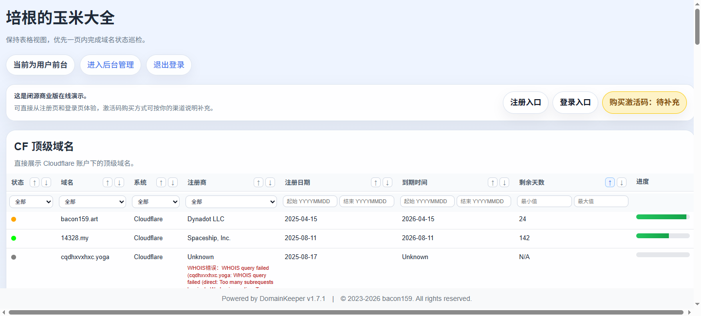
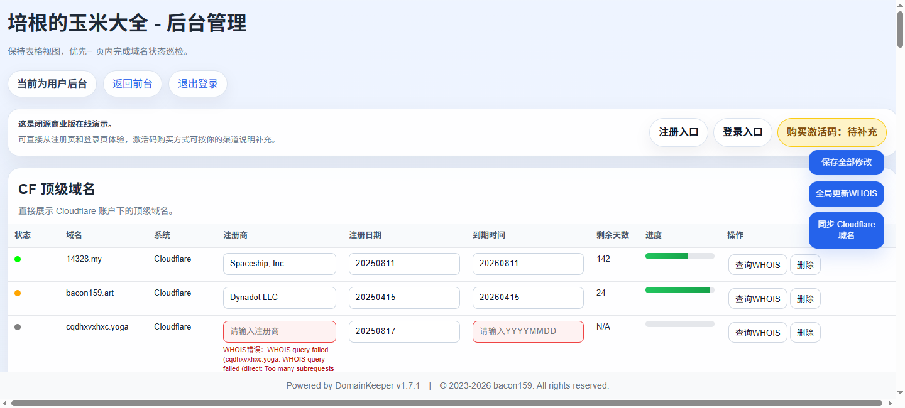

# DomainKeeper

DomainKeeper 是一款闭源的域名管理软件。

## 在线演示

- 演示地址：<https://ym.bacon123.eu.org/>
- 注册入口：<https://ym.bacon123.eu.org/register>
- 登录入口：<https://ym.bacon123.eu.org/login>
- 激活码购买地址：`[待补充]`
- 激活码咨询方式：`[待补充]`

## 演示预览

### 前台效果

### 后台效果

## 使用说明

- 注册时需要输入有效激活码
- 注册成功后，每位用户都会拥有自己的专属访问地址
- 前台地址格式：`/{用户名}`
- 后台地址格式：`/{用户名}/admin`

## 说明

- 本仓库仅用于公开展示说明
- 软件源码与内部实现不公开

## Star History

